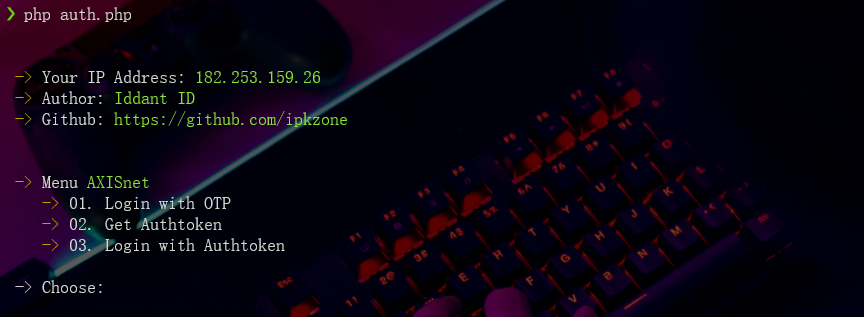

# Simple Script Tools AXISnet
`author: Iddant ID`
`script provider axisnet cli`

# Example view tools
<center></center>
<center></center>

# Next Update
<center></center>

# New Fiture
```shell
- Login with OTO
- Get Authtoken for login
- Login with authtoken

- Auto save token before get auth with file token.txt
```

# Installations
```shell
git clone https://github.com/ipkzone/axisnet
cd axisnet
php main.php --axisnet
```

install command in 

```shell
pkg update && pkg upgrade
pkg install curl && php7
```

# Usage
- Termux Android
```shell
php main.php --axisnet
```
- Other Linux Manchine
```shell
php main.php --axisnet
```

# Note
The script runs with the license key,
if you don't have a license key then you can't run it,
to get a license key you have to ask the creator for its activation for a donation of course,
This script blocks multiple user logins so that the script remains safe and secure.

regards,
**Iddant ID**
