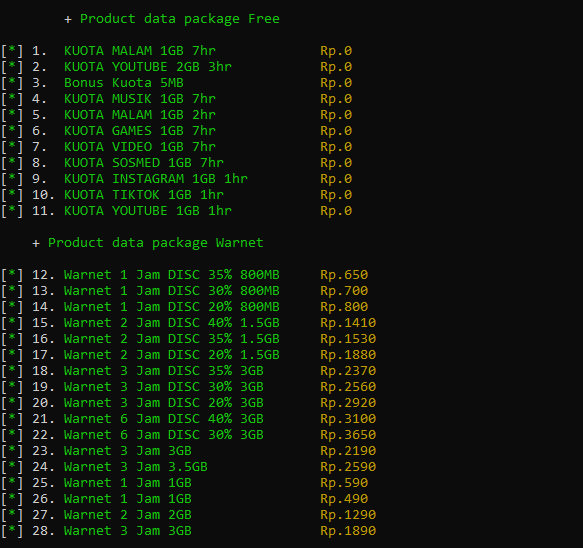
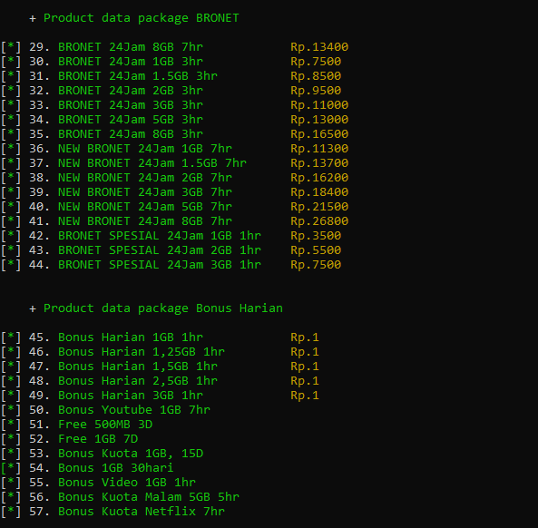

# Simple Script Tools AXISnet
`author: Iddant ID`
`script provider axisnet cli`

# Example view tools
<center></center>
<center></center>

Instalasi `HMSC` in termux or window following github Eddie Kiddiw
```shell
https://github.com/eddiekidiw/HMSC
```

Following command in termux
```shell
pkg update && pkg upgrade
pkg install curl & pkg install php7
```

Instalasi `HMSC` in termux example
```shell
curl https://raw.githubusercontent.com/EddieKidiw/HMSC/main/Linux/Termux/armv7/php7.4/nts/hmsc.so --output hmsc.so for armv7
curl https://raw.githubusercontent.com/EddieKidiw/HMSC/main/Linux/Termux/aarch64/php7.4/zts/hmsc.so --output hmsc.so for aarch64
```
Copy file hmsc.so to path lib/php
```shell
cp hmsc.so /data/data/com.termux/files/usr/lib/php/hmsc.so + Enter
```

Isi file php.ini mengunakan command nano
```shell
nano php.ini

Copy paste in script

safe_mode = Off
;;;;;;;;;;;;;;;;;;;;;;
; Dynamic Extensions ;
;;;;;;;;;;;;;;;;;;;;;;
;
zend_extension=hmsc.so

CTRL+X , Y ,Enter
```
Copy php.ini in your path
```shell
cp php.ini /data/data/com.termux/files/usr/lib/

result
/data/data/com.termux/files/usr/lib/php.ini
```

# Installations
```shell
git clone https://github.com/ipkzone/axisnet
cd axisnet
php main.php --axisnet
```

install them on your linux manchine by following command in 

```shell
apt get install php7.4 apt get install curl
```
in the above for `termux in android` in other linux manchine use following command
```shell
pkg install php7.4 pkg install curl
```
# Usage
- Termux Android
```shell
php main.php --axisnet
```
- Other Linux Manchine
```shell
php main.php --axisnet
```

# Buy License key
```shell
Join Whatsapp: https://chat.whatsapp.com/Bn8JeZTOco6B19n0BkKsNe
```

# Note
The script runs with the license key,
if you don't have a license key then you can't run it,
to get a license key you have to ask the creator for its activation for a donation of course,
This script blocks multiple user logins so that the script remains safe and secure.

regards,
**Iddant ID**
