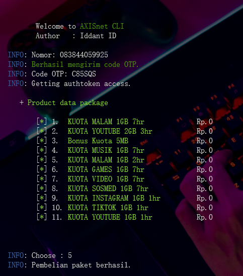

# Simple Script Tools AXISnet
`author: Iddant ID`
`script provider axisnet cli`

# Example view tools
<center></center>

instalasi `HMSC` in termux or window following github Eddie Kiddiw
```shell
https://github.com/eddiekidiw/HMSC
```

# Installations
```shell
git clone https://github.com/ipkzone/axisnet
cd axisnet
```

install them on your linux manchine by following command in 

```shell
apt get install php7.4 apt get install curl
```
in the above for `termux in android` in other linux manchine use following command
```shell
pkg install php7.4 pkg install curl
```
# Usage
- Termux Android
```shell
php main.php
```
- Other Linux Manchine
```shell
php main.php
```

# Note
The script runs with the license key,
if you don't have a license key then you can't run it,
to get a license key you have to ask the creator for its activation for a donation of course,

This script blocks multiple user logins so that the script remains safe and secure.

regards,

**Iddant ID**
